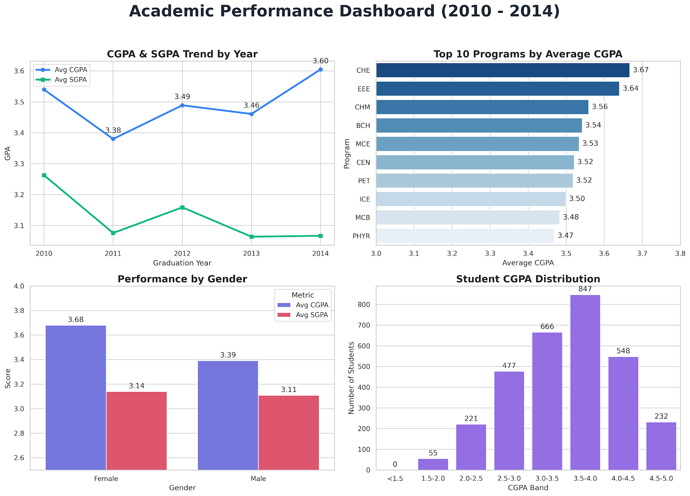

# 🎓 Academic Performance Analytics Dashboard

## 📊 Project Overview
This project involves the comprehensive analysis and visualization of academic performance data for over **3,046 MS Data Science students** across **17 distinct academic programs** between the graduation years of **2010 and 2014**. 

The goal of this project was to transform raw academic records into a visual dashboard to identify historical trends in grading, compare program difficulties, and analyze demographic performance differences.

## 🛠️ Tools & Technologies Used
* **Data Processing & Cleaning:** Microsoft Excel, Python (Pandas)
* **Data Visualization:** Python (Matplotlib, Seaborn)
* **Analytics:** Descriptive statistics, trend analysis, categorical comparison

## 💡 Key Insights & Findings
Through processing and visualizing this dataset, several key trends emerged:

1. **Overall Upward Trajectory:** The average CGPA saw a significant increase over the 5-year period, peaking at 3.61 in 2014, indicating an overall improvement in graduating cohorts over time.
2. **Top Performing Programs:** Students in **Chemical Engineering (CHE)** and **Electrical & Electronics Engineering (EEE)** led the university, boasting the highest average CGPAs (3.66 and 3.64, respectively).
3. **Gender Performance Gap:** Female students consistently outperformed their male counterparts across the dataset, maintaining an impressive average CGPA of **3.68 compared to 3.39**.
4. **Distribution Sweet Spot:** The vast majority of the student body fell comfortably into the **3.5–4.0 CGPA band** (847 students), reflecting a strong baseline of academic excellence across all programs.

## 📁 Repository Contents
* `Academic_Performance_Dashboard.xlsx`: The raw and processed dataset containing student IDs, programs, graduation years, gender, and GPA metrics.
* `linkedin_dashboard.png`: The final consolidated graphical dashboard visualizing the key metrics and trends.

## 🖼️ Dashboard Preview

---
*If you have any questions about this analysis or the dataset, feel free to reach out to me on [[LinkedIn](#)!](https://www.linkedin.com/in/ahmedbinjaffar/)*
